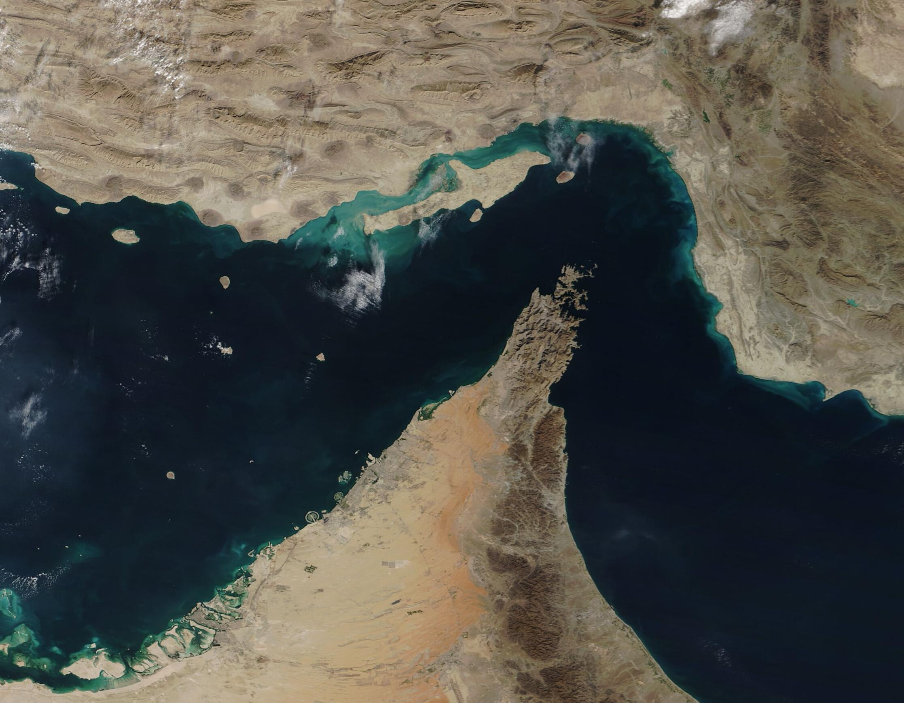

# Daily News FA | خبرهای روزانه فارسی

هر روز، خبرهای مهم روز قبل به زبان فارسی، با ذکر منبع.

Every day, the previous day's top news in Persian, with sources.

## آخرین خبرها | Latest

### [سه‌شنبه ۲۹ سپتامبر ۲۰۲۶ (۷ مهر ۱۴۰۵)](2026-09-29.md)

*تصویر: تنگه هرمز از دید ماهواره MODIS ناسا (۴ دسامبر ۲۰۲۰)، مالکیت عمومی (Public Domain) — [منبع در ویکی‌مدیا](https://commons.wikimedia.org/wiki/File:Strait_of_Hormuz_(MODIS_2020-12-04).jpg)*

مذاکرات غیرمستقیم آمریکا و ایران و طرح بازگشایی مرحله‌ای هرمز • ادعای «دست خارجی» روبیو درباره فیرفورد و تکذیب تهران • ۹ کشته در حمله روسیه و سقوط پهپاد نزدیک مرز لهستان • عرضه GPT-6.1 Sol در DevDay و لغو Astra • عقب‌ماندگی ثبت‌نام رأی‌دهندگان تگزاس • گرامیداشت خروج ائتلاف از موصل • تحریم ۱۰ نهاد حامی ارتش ایران

## برنامه‌نویسی و هوش مصنوعی | Dev & AI

### [سه‌شنبه ۲۹ سپتامبر ۲۰۲۶](dev-ai-2026-09-29.md)

عرضه GPT-6.1 Sol در DevDay • لغو Astra و عذرخواهی هک سایت استرالیا • توقف آموزش قدرتمندترین مدل‌ها • بحث‌های V2EX (آیفون/هواوی، استارتاپ، خودروی هوشمند)

## ساختار

- هر روز یک فایل: `YYYY-MM-DD.md` (به تاریخ میلادیِ روزی که خبرها مال آن است)
- مثال: `2026-09-27.md` = خبرهای یکشنبه ۲۷ سپتامبر ۲۰۲۶ (۵ مهر ۱۴۰۵)

## فهرست

- [2026-09-29](2026-09-29.md) — مذاکرات غیرمستقیم آمریکا و ایران و طرح هرمز، پس‌لرزه فیرفورد، حمله روسیه و پهپاد لهستان، Sol و Astra، تگزاس، موصل، تحریم ۱۰ نهاد
- [dev-ai-2026-09-29](dev-ai-2026-09-29.md) — برنامه‌نویسی و هوش مصنوعی: عرضه Sol، لغو Astra، عذرخواهی استرالیا، توقف آموزش، بحث V2EX
- [2026-09-28](2026-09-28.md) — حمله پهپادی به کی‌یف، مذاکرات آمریکا و ایران، بازداشت‌های فیرفورد، غزه ۷۴ هزار، لغو Astra، مادرید، لوردس، سنای فرانسه، ابولا
- [dev-ai-2026-09-28](dev-ai-2026-09-28.md) — برنامه‌نویسی و هوش مصنوعی: لغو Astra، گزارش‌های ناهمراستایی، ده‌ها هزار حادثه، بحث V2EX
- [2026-09-27](2026-09-27.md) — تنگه هرمز، صربستان، انفجار آتن، دیدار ترامپ-شی، هشدار پاپ درباره هوش مصنوعی، کمک نظامی اتحادیه اروپا به اوکراین، توقف آموزش OpenAI، هشدار بیل گیتس
- [dev-ai-2026-09-27](dev-ai-2026-09-27.md) — برنامه‌نویسی و هوش مصنوعی: مدل‌ها، ابزارها، بحث‌های کامیونیتی
