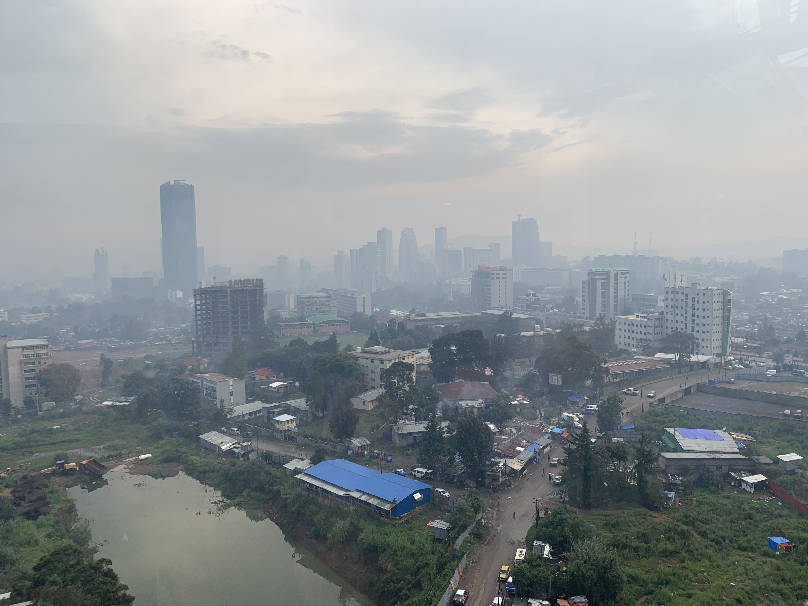

# Daily News FA | خبرهای روزانه فارسی

هر روز، خبرهای مهم روز قبل به زبان فارسی، با ذکر منبع.

Every day, the previous day's top news in Persian, with sources.

## آخرین خبرها | Latest

### [پنجشنبه ۱ اکتبر ۲۰۲۶ (۹ مهر ۱۴۰۵)](2026-10-01.md)

*تصویر: آدیس‌آبابا، سپتامبر ۲۰۲۲، CC BY 4.0 (کاربر Mjr74) — [منبع در ویکی‌مدیا](https://commons.wikimedia.org/wiki/File:Addis_Ababa_September_2022.jpg)*

قطع کامل روابط اتیوپی و اریتره و انفجارهای آدیس‌آبابا • حملات هوایی پاکستان به افغانستان و اختلاف بر سر تلفات • تعلیق عملیات کتائب حزب‌الله پس از خروج آمریکا • بازداشت جدید در پرونده فیرفورد و آزادی زودهنگام زندانیان بریتانیا • پرتاب Crew-13 • آتش خودی سوخو-۳۵، کرانه باختری، سودان، مصر و ژاپن

## برنامه‌نویسی و هوش مصنوعی | Dev & AI

### [پنجشنبه ۱ اکتبر ۲۰۲۶](dev-ai-2026-10-01.md)

عرضه Gemini 4 Argon • آواتار ایجنتی Dots • خرید World Labs توسط AMD • جذب ۱ میلیارد دلاری Instinct • گجت Museمحور متا • سخت‌گیری اپل در Full Disk Access • بحث‌های HN و V2EX

## ساختار

- هر روز یک فایل: `YYYY-MM-DD.md` (به تاریخ میلادیِ روزی که خبرها مال آن است)
- مثال: `2026-09-27.md` = خبرهای یکشنبه ۲۷ سپتامبر ۲۰۲۶ (۵ مهر ۱۴۰۵)

## فهرست

- [2026-10-01](2026-10-01.md) — قطع روابط اتیوپی و اریتره، حملات پاکستان به افغانستان، تعلیق کتائب حزب‌الله، بازداشت فیرفورد، آزادی زندانیان بریتانیا، پرتاب Crew-13
- [dev-ai-2026-10-01](dev-ai-2026-10-01.md) — برنامه‌نویسی و هوش مصنوعی: عرضه Gemini 4 Argon، آواتار Dots، خرید World Labs، جذب Instinct، بحث HN و V2EX
- [2026-09-29](2026-09-29.md) — مذاکرات غیرمستقیم آمریکا و ایران و طرح هرمز، پس‌لرزه فیرفورد، حمله روسیه و پهپاد لهستان، Sol و Astra، تگزاس، موصل، تحریم ۱۰ نهاد
- [dev-ai-2026-09-29](dev-ai-2026-09-29.md) — برنامه‌نویسی و هوش مصنوعی: عرضه Sol، لغو Astra، عذرخواهی استرالیا، توقف آموزش، بحث V2EX
- [2026-09-28](2026-09-28.md) — حمله پهپادی به کی‌یف، مذاکرات آمریکا و ایران، بازداشت‌های فیرفورد، غزه ۷۴ هزار، لغو Astra، مادرید، لوردس، سنای فرانسه، ابولا
- [dev-ai-2026-09-28](dev-ai-2026-09-28.md) — برنامه‌نویسی و هوش مصنوعی: لغو Astra، گزارش‌های ناهمراستایی، ده‌ها هزار حادثه، بحث V2EX
- [2026-09-27](2026-09-27.md) — تنگه هرمز، صربستان، انفجار آتن، دیدار ترامپ-شی، هشدار پاپ درباره هوش مصنوعی، کمک نظامی اتحادیه اروپا به اوکراین، توقف آموزش OpenAI، هشدار بیل گیتس
- [dev-ai-2026-09-27](dev-ai-2026-09-27.md) — برنامه‌نویسی و هوش مصنوعی: مدل‌ها، ابزارها، بحث‌های کامیونیتی
